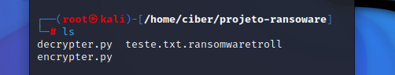
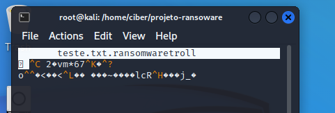
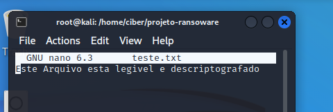

# Decrypter

Este projeto contém um script em Python para criptografar e descriptografar arquivos utilizando a biblioteca `pyaes` no arquivo teste.txt.

## Requisitos

Antes de executar o script, certifique-se de que sua máquina possui os seguintes requisitos:

- Python 3 instalado
- A biblioteca `pyaes` instalada
- Acesso à internet para instalar dependências (se necessário)

## Execução do Script

Para rodar o script `encrypter.py`:

```bash
python encrypter.py
```

# Arquivo que anteriormente se chamava teste.txt agora é um novo arquivo criptografado:





Para rodar o script `decrypter.py`:

```bash
python decrypter.py
```
# Agora, descriptografando esse arquivo que foi criado:





